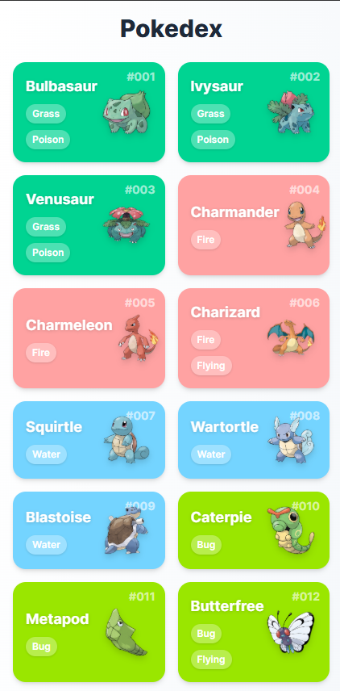
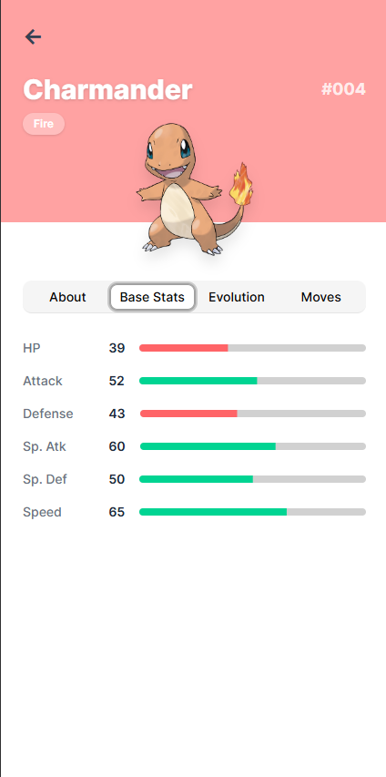

# Pokédex Website

A modern Pokédex web application that allows users to browse through a list of Pokémon and view their detailed information. This project utilizes the [PokéAPI](https://pokeapi.co/) to fetch Pokémon data.

## Features

- 📱 Browse through a list of Pokémon
- 🔍 View detailed information about each Pokémon
- 🎨 Modern and responsive UI
- ⚡️ Fast and efficient data loading
- 🔄 Real-time data from PokéAPI

## Screenshots




## Tech Stack

- ⚛️ React Router v7 for routing
- 🎨 Shadcn UI components
- 🎯 TypeScript for type safety
- 🎨 TailwindCSS for styling
- 🔄 React Query for data fetching
- 📦 Vite for build tooling

## Getting Started

### Prerequisites

- Node.js (v20 or higher)
- npm or yarn

### Installation

1. Clone the repository
2. Install dependencies:

```bash
npm install
```

### Development

Start the development server:

```bash
npm run dev
```

The application will be available at `http://localhost:5173`

## API Reference

This project uses the [PokéAPI](https://pokeapi.co/) to fetch Pokémon data. The API is free to use and doesn't require authentication.
